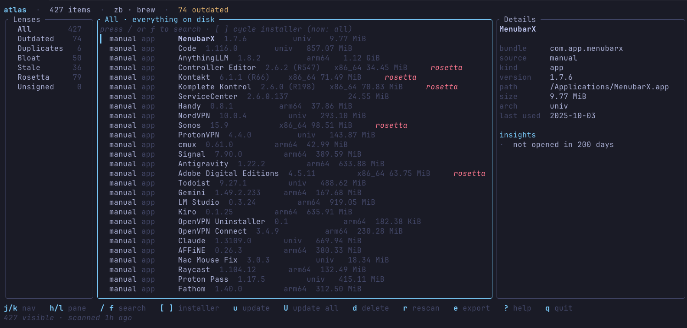

<div align="center">

# atlas

**Native control plane for your Mac's software stack.**

One unified view of every `.app`, formula, cask, and App Store install — with owner-aware updates, uninstalls, and reproducible migration manifests.

[install](#install) · [lenses](#lenses) · [cli for agents](#cli-for-scripts--agents) · [site](https://friedscholvinck.github.io/atlas)

<br>



</div>

<br>

## Why

Every Mac accumulates software from five or six different installers — Homebrew, zerobrew, the App Store, global npm/pipx packages, manual `.app` drops, vendor updaters. Nothing tells you the complete picture in one place. Atlas does, locally, in under two seconds.

- **One row per thing**, not per installer. A formula present in both brew and zerobrew collapses into a single row attributed to whichever you actually use.
- **Provenance, not guesses.** Bundle id, install path, arch (arm64 / x86_64 / universal), size on disk, last-used date — all resolved from the local filesystem and Spotlight.
- **Owner-aware actions.** `u` updates via the real installer. `d` uninstalls via the real installer (or moves a manual `.app` to Finder Trash). Nothing is forged.
- **Reproducible.** Export `manifest.json` + `Brewfile` + `mas.txt` so a new Mac is a one-liner away.

<br>

## Install

```sh
# curl
curl -fsSL https://friedscholvinck.github.io/atlas/install.sh | sh

# homebrew (HEAD tap until the first release is cut)
brew tap friedscholvinck/atlas https://github.com/FriedScholvinck/atlas.git
brew install --HEAD friedscholvinck/atlas/atlas
```

Requires macOS 13+. v0 builds from source via a working Rust toolchain; signed prebuilt binaries land with the first tagged release.

### From source

```sh
git clone https://github.com/FriedScholvinck/atlas.git
cd atlas
cargo build --release
./target/release/atlas tui
```

<br>

## Lenses

One-keystroke filters over the same inventory.

| Lens | What it shows |
|---|---|
| **All** | Everything on disk |
| **Outdated** | Items with a known upgrade from their installer |
| **Duplicates** | The same tool installed through more than one manager |
| **Bloat** | Top 50 by disk usage |
| **Stale** | `.app` bundles you haven't opened in 90+ days |
| **Rosetta** | x86_64-only apps running under Rosetta on Apple Silicon |
| **Unsigned** | Missing a valid code signature |

<br>

## Keys

| | |
|---|---|
| `j` `k` · `g` `G` | nav · top/bottom |
| `h` `l` `tab` | switch pane |
| `/` or `f` | search name · bundle id |
| `[` `]` | cycle installer filter |
| `s` | cycle sort — biggest / longest-ago / recent / most-used / least-used |
| `u` · `U` | update selected · update everything |
| `d` | delete (via installer, or `.app` to Trash) |
| `r` · `e` · `?` · `q` | rescan · export · help · quit |

<br>

## CLI for scripts & agents

The TUI is for humans. The subcommand surface is for everything else — shell, CI, LLM agents. Strictly read-only, so a hallucinating model can't uninstall anything.

```sh
atlas doctor --json                                     # totals, counts per source / kind, outdated, storage footprint
atlas list --lens stale --sort size --limit 20 --json   # biggest apps you don't open — top cleanup targets
atlas list --lens outdated --json                       # every upgradeable item, full records
atlas list --source brew --filter ripgrep               # plain-text for piping to grep / awk
atlas info com.apple.dt.Xcode --json                    # one item by bundle-id, name, or id
```

Lenses: `all · outdated · duplicates · bloat · stale · rosetta · unsigned`.
Sources: `brew · zb · mas · manual · npm · pipx · uv`.
Sort: `size · old · recent · frequent · rare · none`.
Add `--rescan` to bypass the cached snapshot.

### Agent skill

Drop [`skills/mac-cleanup/SKILL.md`](./skills/mac-cleanup/SKILL.md) into Claude Code, Cursor, or any skill-aware coding agent. It teaches the model when to invoke Atlas, how to synthesize the JSON output into cleanup recommendations, and how to route uninstalls safely (brew, zb, mas, or Finder Trash). Everything stays local.

<br>

## Roadmap

Atlas provides the perfect foundation for cleaning up your Mac, but there's always more to track:
- **Scan locally installed Agent Skills:** The AI era comes with an explosion of locally installed agent skills. We plan to identify installed skills across tools like Claude Code and Goose.
- **Support for more global tools:** Cargo, Gem, and Go.
- **Uninstaller safety:** Providing safe, isolated uninstall flows for various global CLI tools.

<br>

## Design

- Merge engine dedupes by bundle id → install path → (kind, name).
- Source preference ranks `zb > mas > brew > npm > pipx > uv > manual`.
- Snapshot cached at `~/Library/Application Support/dev.atlas.Atlas/index.json` as plain JSON — no SQLite, no daemon.

Coding agents working in this repo: read [`AGENTS.md`](./AGENTS.md) first.

<br>

## License

MIT — see [`LICENSE`](./LICENSE).
